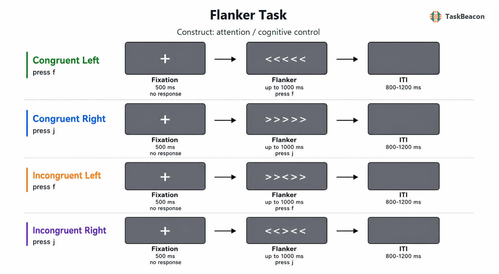

# Eriksen Flanker 范式：选择性注意、反应冲突与认知控制的实验研究

目标信息与相邻干扰信息同时出现时，认知系统如何选择与当前目标一致的反应，是选择性注意和认知控制研究的基本问题。Eriksen Flanker 任务（Eriksen flanker task，亦称侧抑制任务或干扰箭头任务）通过保持目标及反应规则相对简单、仅改变目标与侧翼刺激的反应一致性，使无关信息引发的竞争能够表现为反应时、正确率及神经活动的条件差异。该范式由视觉选择研究发展而来，随后成为考察反应竞争、冲突监测、适应性控制和错误加工的主要工具。其方法学价值在于干扰源可被精确操纵，并可通过刺激间距、呈现异步性、相容试次比例及前一试次情境进一步分解；其解释边界则在于“不一致减一致”的差值同时受知觉选择、反应激活、速度—正确率权衡和序列学习影响，不能被无条件视为单一、纯粹的抑制能力指标。

## 1. 范式提出与理论发展

Eriksen 与 Eriksen（1974）为解决视觉搜索研究中目标位置不确定、眼动及搜索过程彼此混杂的问题，固定目标位置并在其两侧呈现噪声字母。原始任务要求参与者依据中央目标字母所属的二选一反应集合按键；侧翼字母可能与目标相同、不同但映射至同一反应，或映射至相反反应。相反反应集合的侧翼字母造成更长反应时，且干扰随目标—侧翼距离增大而减弱。该结果表明，空间注意不能完全排除邻近无关信息，干扰的重要部分发生在反应竞争阶段，而不只是目标字形识别困难。

连续流观点进一步提出，刺激分析尚未完成时，部分信息已可连续传递并激活相应反应；不一致侧翼因此会先部分激活错误反应，随后才由目标证据支持的正确反应占据优势（Eriksen & Schultz, 1979）。箭头版本以高度熟悉的方向符号取代任意字母—按键映射，使侧翼方向与反应方向的关系更直接。Stoffels 与 van der Molen（1988）的工作确立了箭头侧翼刺激在选择反应研究中的应用，此后形成当前常见的中央箭头判断形式（Ridderinkhof et al., 2021）。箭头的空间含义具有较强的自动激活倾向，因此该版本尤其适于研究错误反应捕获及其后续抑制，但其效应不应简单推广到所有字母、颜色或语义版本。

范式的另一发展是由单试次冲突转向情境依赖的适应。相对于前一试次一致，前一试次不一致之后的当前干扰效应通常减小，即一致性序列效应。该现象最初被解释为参与者根据近期冲突提高对目标通道的选择性（Gratton et al., 1992），并被冲突监测理论表述为监测系统依据反应冲突调整后续控制强度（Botvinick et al., 2001）。然而，刺激—反应特征重复、条件转移概率和偶然性学习均可产生相似序列模式。因此，只有在控制完全重复、部分重复及条件频率后，序列差异才更适合支持适应性控制解释。

## 2. 任务逻辑、流程与核心测量

典型箭头任务在注视后呈现由中央目标和两侧侧翼组成的阵列。参与者只报告中央箭头朝向：一致条件中目标与侧翼指向相同（如 `<<<<<`），不一致条件中二者指向相反（如 `>><>>`）；部分研究另设中性侧翼以区分一致促进与不一致干扰。刺激可持续至反应或在固定时限后消失，随后进入固定或抖动的试次间隔。研究间并不存在唯一的标准时长、反馈或区组数；这些参数须根据行为、EEG 或 fMRI 设计分别报告。多数基础版本不提供逐试次奖励，也不采用自适应难度。若以错误率闭环调节反应期限，则所得指标还包含控制器所施加的难度变化，不能与固定时限版本直接合并。

主要因变量为正确试次反应时与正确率。反应时干扰效应通常定义为不一致条件均值减一致条件均值，正确率干扰效应则可定义为一致条件正确率减不一致条件正确率。前者为正、后者为正时均表示不一致试次代价。均值分析宜同时报告各条件原始水平，并检查极端反应、遗漏和速度—正确率权衡；仅报告差值可能掩盖总体加工速度或正确率天花板。反应时分布还能区分快速错误捕获与较慢选择性抑制：不一致试次中早期错误反应增多，并不等同于所有时间段均存在相同强度的控制缺陷（Ridderinkhof et al., 2021）。

条件对比对应的构念需保持操作性界定。`不一致 > 一致` 的行为代价支持无关侧翼影响了目标反应选择，但该差值同时包含侧翼知觉加工和竞争反应激活。目标—侧翼距离效应考察空间注意范围；相容试次比例效应考察对冲突概率的情境调节；当前一致性与前一试次一致性的交互考察序列适应。错误后减速反映错误之后的行为调整，但也可能来自定向反应或偶发性延迟，而非必然有效的控制增强。因而，“选择性注意”“干扰控制”“冲突监测”和“错误加工”分别对应不同操控与指标，不宜由单一干扰分数同时代表。

## 3. 行为与认知神经科学证据

### 3.1 反应竞争与适应性控制

跨刺激材料的基本结果较为一致：不一致侧翼使反应变慢并增加错误，近距离侧翼通常产生更大干扰。连续流模型将其解释为目标与侧翼证据并行累积、竞争反应部分共激活；肌电和侧化准备电位所揭示的错误侧反应准备为此提供了时间过程证据（Eriksen & Schultz, 1979; Kopp et al., 1996）。该证据支持“无关信息到达反应系统”，但不要求假定一个全或无的抑制闸门。

序列和比例操控表明控制具有情境敏感性。高冲突经历之后干扰效应可缩小，冲突频率也能改变参与者对侧翼信息的利用（Gratton et al., 1992; Jost et al., 2022）。这些效应既可来自反应阈值或注意选择的调整，也可来自具体刺激—反应组合的预测。研究设计因此需要平衡目标方向与侧翼方向、控制特征重复，并避免将区组比例与局部条件概率混为同一过程。经典群体效应可高度稳健，个体差异的来源却可能因任务版本而改变。

### 3.2 fMRI 与 EEG 所揭示的时空过程

事件相关 fMRI 研究显示，相较低冲突试次，高冲突正确试次常伴随背侧前扣带/中扣带及外侧额顶控制区域更强的血氧水平依赖信号。Botvinick 等（1999）利用反应竞争强度与反应选择要求可分离的侧翼任务，支持前扣带活动与冲突监测相关；跨 Stroop、Flanker、Simon 等干扰任务的元分析则提示前扣带、外侧前额叶、前岛和顶叶共同参与干扰检测与解决（Nee et al., 2007）。这些结果说明冲突条件调动分布式控制网络，不能据区域激活将干扰效应归结为单一“抑制中枢”。BOLD 的时间分辨率及条件间反应时差异也要求控制一般任务时长效应，相关活动本身不证明某一区域对行为差异具有因果作用。

EEG/事件相关电位（event-related potential, ERP）补充了毫秒级过程。刺激锁定的额中央 N2 往往在不一致条件更负，侧化准备电位可在正确反应前揭示侧翼诱发的错误侧运动激活；反应锁定的错误相关负波（error-related negativity, ERN）和随后错误正波（Pe）则分别关联快速错误检测与较晚的错误觉察/评价（Kopp et al., 1996; van Veen & Carter, 2002）。儿童两次 Flanker 测量的潜变量分析进一步显示，ERN、Pe 与错误后行为调整之间存在可估计联系，但结果同时包含稳定特质与会话状态成分（Lin et al., 2022）。N2 的功能解释仍有异质性：时间侧翼任务中相容比例能够调节 N2，但同步呈现研究并非均得到同样结果，说明 N2 可能同时受错误反应识别、冲突及反应性调节影响（Jost et al., 2022）。头皮电位的空间定位亦不足以单独确定神经发生源。

## 4. 发展、临床与标准化应用

Flanker 任务已由基础成人实验扩展至毕生发展和临床研究。儿童到成人的发展研究显示，无关信息造成的干扰来源及时间过程随年龄改变，发展差异既涉及目标选择，也涉及反应竞争的控制（Ridderinkhof et al., 1997）。注意网络测验将箭头 Flanker 与警觉、空间定向线索相结合，以不同操作对比估计警觉、定向和执行控制效率；该设计扩大了范式用途，但其“执行控制”分数仍是特定线索结构中的一致性代价（Fan et al., 2002）。NIH Toolbox 随后将 Flanker 与发展阶段适配规则和组合计分纳入标准化认知测量，在成人样本中获得年龄敏感性、重测信度以及聚合和区分效度证据，使该任务可用于流行病学与临床试验中的抑制控制/选择性注意评估（Zelazo et al., 2014）。标准化版本的计分和刺激并不等同于实验室中简单的反应时差值，跨研究比较时应明确版本。

临床应用的主要价值是描述反应竞争的条件性变化，而非依据单次得分作诊断。帕金森病研究通过箭头 Flanker 与反应时分布分析发现，速度—正确率策略会改变错误反应捕获和干扰控制的组间模式（Wylie et al., 2009）。这说明平均反应时可能遗漏短潜伏期冲动反应的差异，也说明药物状态、运动迟缓和按键能力会混入临床效应。针对注意缺陷多动障碍等人群，平均 Flanker 代价的组间结果并不总是一致（Ridderinkhof et al., 2021）。群体水平差异因此不能直接转化为个体诊断阈值，临床解释需要常模、重复测量及与症状和功能结局的独立关联。

## 5. 信度、效度与解释边界

Flanker 效应具有清楚的实验效度：在组内操控中，不一致条件通常稳定劣于一致条件。但差值的个体重测信度常低于各条件原始反应时，这是因为两个高度相关条件相减后，个体间真实方差被压缩，而误差占比上升，即所谓“信度悖论”（Hedge et al., 2018）。智能手机在线研究仍能复现 Flanker 效应，并在适当设计下获得中等信度，但设备、样本与试次数均会改变估计（Pronk et al., 2022）。可变间距在线版本中，跨距离平均的反应时干扰效应重测 ICC 为 0.745，而单一距离差值、正确率差值及接近天花板的指标更不稳定（Lee & Pitt, 2024）。这些结果不支持把任何箭头版本预设为同等可靠。

构念效度同样取决于参数。较大的不一致代价可能表示侧翼过滤较弱，也可能来自更谨慎的正确反应、总体加工较慢或刺激—反应映射尚未熟练。箭头版本减少任意映射学习，却增加方向符号与空间反应的高度相容性。逐试次反馈、奖励、反应期限和不一致比例会改变策略及序列效应；固定顺序还可能引入学习和疲劳。研究若关注个体差异，应预先规定清理规则，报告条件原始分数和差值的信度，并通过层级模型或分布参数检验结论是否依赖均值。研究若关注神经对比，则需保证足够的正确不一致试次和错误试次，并避免把 N2、ERN 或 BOLD 条件差异直接当作临床生物标志物。

## 6. TaskBeacon 中的任务实现

### 6.1 任务资源与访问入口

| 资源 | ID | 用途 | 地址 |
|---|---|---|---|
| 完整实验实现 | T000004 | PsychoPy/PsyFlow 行为与 EEG 采集版本 | [源码仓库](https://github.com/TaskBeacon/T000004-flanker) |
| 浏览器预览源码 | H000004 | psyflow-web 行为型原型，不含 EEG 采集硬件 | [源码仓库](https://github.com/TaskBeacon/H000004-flanker) |
| 公开体验入口 | H000004 | 在线体验浏览器预览 | [运行任务](https://taskbeacon.github.io/psyflow-web/?task=H000004-flanker) |

T000004 的任务清单将采集类型标为 EEG，当前成熟度为 `smoke_tested`；H000004 被标为行为采集、HTML 变体及 `prototype`。H 仓库说明将其定位为浏览器预览。其当前公开配置与 T 版同为 3 个区组、每区组 60 试次，而非可替代 EEG 触发、实验显示器控制和实验室采集环境的等价版本。浏览器中的设备、刷新率、键盘与观看距离差异也会限制毫秒级反应时和视觉角度的可比性。

### 6.2 实现流程与关键参数

TaskBeacon 当前版本以四个平衡条件组合侧翼一致性与中央目标方向：`congruent_left`、`congruent_right`、`incongruent_left` 和 `incongruent_right`。参与者用 `f` 键报告左向目标、用 `j` 键报告右向目标。完整任务共 180 试次，分为 3 个区组；每区组结束后呈现该区组正确率。记录字段可支持按一致性与目标方向计算正确率、正确试次反应时、遗漏及干扰效应。该实现没有中性条件，因而可以估计不一致相对一致的总代价，但不能分别识别一致促进与不一致干扰。

*图 1. TaskBeacon T000004 的单试次流程与参数。每次试次先呈现白色注视点“+”0.5 s，随后呈现五箭头阵列并开放最长 1.0 s 的反应窗；一致左/右条件分别为 `<<<<<`、`>>>>>`，不一致左/右条件分别为 `>><>>`、`<<><<`。参与者只依据中央箭头方向作答，左向按 `f`、右向按 `j`；反应后刺激阶段提前终止，未在 1.0 s 内作答记为超时。试次随后进入 0.8–1.2 s 的空屏抖动间隔。正确性由按键与中央目标方向的映射判定，不提供逐试次奖励或反馈；每区组结束后反馈区组正确率。四类条件由区组调度平衡生成，任务不采用逐试次难度自适应、奖励控制或反应时限阶梯。*

固定 1.0 s 反应窗有利于控制 EEG 事件范围，但会使较慢参与者产生更多遗漏，并改变可观测反应时分布。0.8–1.2 s 抖动间隔有助于降低连续事件时间锁定的规律性；条件触发码区分一致与不一致刺激，反应触发码区分左右按键，可用于 EEG 分段。区组正确率反馈可能影响下一区组的速度—正确率策略，因此分析宜同时检查区组进程。现有仓库文件未表明积分或正确反应会兑换实际金钱。

## 参考文献

Botvinick, M. M., Braver, T. S., Barch, D. M., Carter, C. S., & Cohen, J. D. (2001). Conflict monitoring and cognitive control. *Psychological Review, 108*(3), 624–652. https://doi.org/10.1037/0033-295X.108.3.624

Botvinick, M. M., Nystrom, L. E., Fissell, K., Carter, C. S., & Cohen, J. D. (1999). Conflict monitoring versus selection-for-action in anterior cingulate cortex. *Nature, 402*(6758), 179–181. https://doi.org/10.1038/46035

Eriksen, B. A., & Eriksen, C. W. (1974). Effects of noise letters upon the identification of a target letter in a nonsearch task. *Perception & Psychophysics, 16*(1), 143–149. https://doi.org/10.3758/BF03203267

Eriksen, C. W., & Schultz, D. W. (1979). Information processing in visual search: A continuous flow conception and experimental results. *Perception & Psychophysics, 25*(4), 249–263. https://doi.org/10.3758/BF03198804

Fan, J., McCandliss, B. D., Sommer, T., Raz, A., & Posner, M. I. (2002). Testing the efficiency and independence of attentional networks. *Journal of Cognitive Neuroscience, 14*(3), 340–347. https://doi.org/10.1162/089892902317361886

Gratton, G., Coles, M. G. H., & Donchin, E. (1992). Optimizing the use of information: Strategic control of activation of responses. *Journal of Experimental Psychology: General, 121*(4), 480–506. https://doi.org/10.1037/0096-3445.121.4.480

Hedge, C., Powell, G., & Sumner, P. (2018). The reliability paradox: Why robust cognitive tasks do not produce reliable individual differences. *Behavior Research Methods, 50*(3), 1166–1186. https://doi.org/10.3758/s13428-017-0935-1

Jost, K., Wendt, M., Luna-Rodriguez, A., & Jacobsen, T. (2022). Electrophysiological correlates of proportion congruency manipulation in a temporal flanker task. *Psychophysiology, 59*(11), e14092. https://doi.org/10.1111/psyp.14092

Kopp, B., Rist, F., & Mattler, U. (1996). N200 in the flanker task as a neurobehavioral tool for investigating executive control. *Psychophysiology, 33*(3), 282–294. https://doi.org/10.1111/j.1469-8986.1996.tb00425.x

Lee, S. H., & Pitt, M. A. (2024). Implementation of an online spacing flanker task and evaluation of its test–retest reliability using measures of inhibitory control and the distribution of spatial attention. *Behavior Research Methods, 56*(6), 5947–5958. https://doi.org/10.3758/s13428-023-02327-7

Lin, M.-H., Davies, P. L., Taylor, B. K., Prince, M. A., & Gavin, W. J. (2022). Modeling electrophysiological measures of decision-making and performance monitoring in neurotypical children engaging in a speeded flanker task. *Psychophysiology, 59*(3), e13972. https://doi.org/10.1111/psyp.13972

Nee, D. E., Wager, T. D., & Jonides, J. (2007). Interference resolution: Insights from a meta-analysis of neuroimaging tasks. *Cognitive, Affective, & Behavioral Neuroscience, 7*(1), 1–17. https://doi.org/10.3758/CABN.7.1.1

Pronk, T., Hirst, R. J., Wiers, R. W., & Murre, J. M. J. (2022). Can we measure individual differences in cognitive measures reliably via smartphones? A comparison of the flanker effect across device types and samples. *Behavior Research Methods, 55*(4), 1641–1652. https://doi.org/10.3758/s13428-022-01885-6

Ridderinkhof, K. R., van der Molen, M. W., Band, G. P. H., & Bashore, T. R. (1997). Sources of interference from irrelevant information: A developmental study. *Journal of Experimental Child Psychology, 65*(3), 315–341. https://doi.org/10.1006/jecp.1997.2367

Ridderinkhof, K. R., Wylie, S. A., van den Wildenberg, W. P. M., Bashore, T. R., & van der Molen, M. W. (2021). The arrow of time: Advancing insights into action control from the arrow version of the Eriksen flanker task. *Attention, Perception, & Psychophysics, 83*(2), 700–721. https://doi.org/10.3758/s13414-020-02167-z

Stoffels, E. J., & van der Molen, M. W. (1988). Effects of visual and auditory noise on visual choice reaction time in a continuous-flow paradigm. *Perception & Psychophysics, 44*(1), 7–14. https://doi.org/10.3758/BF03207468

van Veen, V., & Carter, C. S. (2002). The timing of action-monitoring processes in the anterior cingulate cortex. *Journal of Cognitive Neuroscience, 14*(4), 593–602. https://doi.org/10.1162/08989290260045837

Wylie, S. A., van den Wildenberg, W. P. M., Ridderinkhof, K. R., Bashore, T. R., Powell, V. D., Manning, C. A., & Wooten, G. F. (2009). The effect of speed-accuracy strategy on response interference control in Parkinson’s disease. *Neuropsychologia, 47*(8–9), 1844–1853. https://doi.org/10.1016/j.neuropsychologia.2009.02.025

Zelazo, P. D., Anderson, J. E., Richler, J., Wallner-Allen, K., Beaumont, J. L., Conway, K. P., Gershon, R., & Weintraub, S. (2014). NIH Toolbox Cognition Battery (CB): Validation of executive function measures in adults. *Journal of the International Neuropsychological Society, 20*(6), 620–629. https://doi.org/10.1017/S1355617714000472
